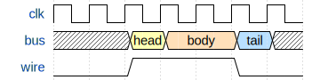
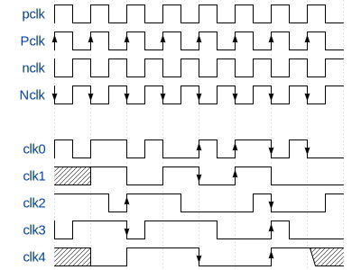

# Main
## Basic Info
- 6 params, 0 ports 
- top module √ 

## params
no params info

## ports
| name | type | width |
| :--- | :--- | :--- |
| a | input | |
| b | input | |
| c | input | |
| Qus | output | |
| Qs | output | |
| `main | output | |

## Dependency
| name | module | path |
| :--- | :--- | :--- |
| dependence_1 | dependence_1 | e:/Project/Digial-IDE/Digital-IDE/test/vlog/dependence_test/child_1.v|
| dependence_2 | dependence_2 | e:/Project/Digial-IDE/Digital-IDE/test/vlog/dependence_test/child_2.v|
| dependence_3 | dependence_3 | |

 
</img>
  

 
</img>
  

